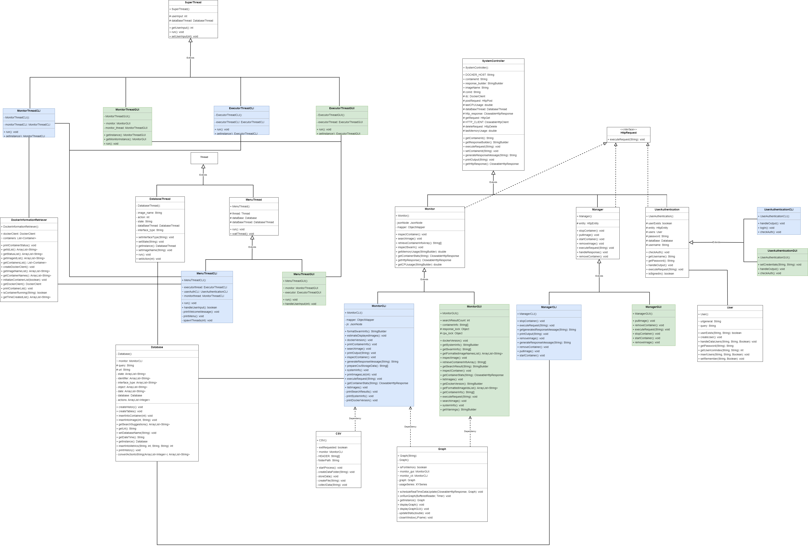

# Project Structure

This section provides an overview of the structural organization of the project. It begins by outlining the useful tools utilized in the project's backend infrastructure, followed by an analysis of the organization within both folders and packages. Furthermore, it presents a visual representation of the project's structure through a UML diagram. Each subsection offers valuable insights into the project's architecture and serves as a comprehensive guide, especially for those who want to contribute.


## Overview 
- [Useful Tools](#useful-tools)
- [Visualization of the Structure](#visualization-of-the-structure)
- [Packages](#packages)
- [UML](#uml)

## 🔧Useful Tools
Mobi leverages a set of powerful tools to ensure a robust and efficient development process. These tools contribute to the project's functionality, user interface, database management, and overall performance.

* **Apache Maven**\
Our project  is built and managed using Apache Maven, a powerful build and project management tool. Maven streamlines the build process, manages dependencies, and ensures a consistent and reliable build for the project.

* **JavaFX and SceneBuilder**\
The graphical user interface (GUI) of Mobi is developed using JavaFX, a framework for building interactive applications. Scene Builder, a visual layout tool, is also integrated to enhance the design and layout of Mobi's user interface.

* **H2 Database (Embedded)**\
Mobi relies on the embedded form of the H2 Database, offering a lightweight and efficient solution for managing project databases. This choice ensures data handling within the application while maintaining a compact and easily deployable database system.

* **Docker APIs and Repository**\
The integration of the [Docker Hub API](https://docs.docker.com/docker-hub/api/latest/) and the [Docker Engine API](https://docs.docker.com/engine/api/v1.43/), both leveraging the HTTP protocol, helps Mobi to form the foundation for communication within the Docker ecosystem. Additionally, Mobi harnesses the capabilities of the [docker-java repository](https://github.com/docker-java/docker-java), sourced directly from GitHub.

## Visualization of the Structure
Visually, the structure follows this plan: 

```
Mobi
├─ .vscode
│  └─ settings.json
├─ config
│  ├─ checkstyle.xml
│  └─ suppressions.xml
├─ docs
│  ├─ contribution.md
│  ├─ launch.md
│  ├─ project_structure.md
│  ├─ todo_list.md
│  ├─ UML.png
│  └─ usage_guidelines.md
├─ jaractions.xml
├─ LICENSE.txt
├─ pom.xml
├─ README.md
├─ src
│  ├─ main
│  │  ├─ java
│  │  │  └─ gr
│  │  │     └─ aueb
│  │  │        └─ dmst
│  │  │           └─ onepercent
│  │  │              └─ programming
│  │  │                 ├─ cli
│  │  │                 │  ├─ ConsoleUnits.java
│  │  │                 │  ├─ CSV.java
│  │  │                 │  ├─ ExecutorThreadCLI.java
│  │  │                 │  ├─ Main.java
│  │  │                 │  ├─ ManagerCLI.java
│  │  │                 │  ├─ MenuThreadCLI.java
│  │  │                 │  ├─ MonitorCLI.java
│  │  │                 │  ├─ MonitorThreadCLI.java
│  │  │                 │  └─ UserAuthenticationCLI.java
│  │  │                 ├─ core
│  │  │                 │  ├─ DockerInformationRetriever.java
│  │  │                 │  ├─ Graph.java
│  │  │                 │  ├─ HttpRequest.java
│  │  │                 │  ├─ Manager.java
│  │  │                 │  ├─ MenuThread.java
│  │  │                 │  ├─ Monitor.java
│  │  │                 │  ├─ SuperThread.java
│  │  │                 │  ├─ SystemController.java
│  │  │                 │  └─ UserAuthentication.java
│  │  │                 ├─ data
│  │  │                 │  ├─ Database.java
│  │  │                 │  ├─ DatabaseThread.java
│  │  │                 │  └─ User.java
│  │  │                 ├─ exceptions
│  │  │                 │  ├─ ActionContainerException.java
│  │  │                 │  ├─ EmptyFieldError.java
│  │  │                 │  ├─ InvalidInputException.java
│  │  │                 │  ├─ PullImageException.java
│  │  │                 │  ├─ RemoveDockerObjectException.java
│  │  │                 │  └─ UserNotFoundException.java
│  │  │                 ├─ graphics
│  │  │                 │  ├─ AnalyticsPageController.java
│  │  │                 │  ├─ ContainersPageController.java
│  │  │                 │  ├─ ImagesPageController.java
│  │  │                 │  ├─ LoginPageController.java
│  │  │                 │  ├─ MainGUI.java
│  │  │                 │  ├─ MainPageController.java
│  │  │                 │  ├─ MiscPageController.java
│  │  │                 │  ├─ NotificationsPageController.java
│  │  │                 │  ├─ PopupController.java
│  │  │                 │  ├─ RunMain.java
│  │  │                 │  ├─ SearchController.java
│  │  │                 │  └─ SystemPageController.java
│  │  │                 └─ gui
│  │  │                    ├─ ExecutorThreadGUI.java
│  │  │                    ├─ ManagerGUI.java
│  │  │                    ├─ MenuThreadGUI.java
│  │  │                    ├─ MonitorGUI.java
│  │  │                    ├─ MonitorThreadGUI.java
│  │  │                    └─ UserAuthenticationGUI.java
│  │  └─ resources
│  │     ├─ dark-theme.css
│  │     ├─ fxml
│  │     │  ├─ AnalyticsPage.fxml
│  │     │  ├─ ContainersPage.fxml
│  │     │  ├─ HelpPage.fxml
│  │     │  ├─ HistoryPage.fxml
│  │     │  ├─ ImagesPage.fxml
│  │     │  ├─ LoginPage.fxml
│  │     │  ├─ MainPage.fxml
│  │     │  ├─ MiscPage.fxml
│  │     │  ├─ NotificationsPage.fxml
│  │     │  ├─ Popup.fxml
│  │     │  ├─ SearchPage.fxml
│  │     │  └─ SystemPage.fxml
│  │     ├─ images
│  │     │  ├─ analyticsPage
│  │     │  │  ├─ container
│  │     │  │  │  ├─ copyBlack.png
│  │     │  │  │  ├─ copyWhite.png
│  │     │  │  │  ├─ gateway.png
│  │     │  │  │  ├─ ip.png
│  │     │  │  │  ├─ mac.png
│  │     │  │  │  └─ network.png
│  │     │  │  └─ swarm
│  │     │  │     ├─ swarm- subnet- size-icon.png
│  │     │  │     ├─ swarm-born-icon.png
│  │     │  │     ├─ swarm-id-icon.png
│  │     │  │     ├─ swarm-name-icon.png
│  │     │  │     ├─ swarm-update-icon.png
│  │     │  │     └─ swarm-version-icon.png
│  │     │  ├─ containersPage
│  │     │  │  ├─ darkPurple.png
│  │     │  │  ├─ lightPurple.png
│  │     │  │  └─ remove-icon.png
│  │     │  ├─ dockerHubPage
│  │     │  │  ├─ imageIcon.png
│  │     │  │  └─ star.png
│  │     │  ├─ helpPage
│  │     │  │  ├─ downloadDocker.png
│  │     │  │  ├─ systemRequirements1.png
│  │     │  │  ├─ systemRequirements2.png
│  │     │  │  └─ systemRequirements3.png
│  │     │  ├─ imagesPage
│  │     │  │  └─ remove-icon.png
│  │     │  ├─ intro
│  │     │  │  ├─ anchorBigLogo.png
│  │     │  │  ├─ anchorSmallLogo.png
│  │     │  │  ├─ chi.png
│  │     │  │  ├─ dockerLogo.png
│  │     │  │  └─ powerOff.png
│  │     │  ├─ mainPage
│  │     │  │  ├─ miscIcon.png
│  │     │  │  ├─ moon.png
│  │     │  │  ├─ sun.png
│  │     │  │  └─ userPhoto.png
│  │     │  ├─ menuIcons
│  │     │  │  ├─ analytics-icon.png
│  │     │  │  ├─ anchor-solid.png
│  │     │  │  ├─ chart-pie-solid.png
│  │     │  │  ├─ codepen-brands.png
│  │     │  │  ├─ cubes-solid.png
│  │     │  │  ├─ info-circle-solid.png
│  │     │  │  ├─ info-final.png
│  │     │  │  ├─ logout.png
│  │     │  │  ├─ store-solid.png
│  │     │  │  └─ system-button-icon.png
│  │     │  ├─ notificationsPage
│  │     │  │  └─ dangerIcon.png
│  │     │  ├─ popup
│  │     │  │  ├─ miniX.png
│  │     │  │  └─ popupX.png
│  │     │  ├─ searchPage
│  │     │  │  ├─ search-icon.png
│  │     │  │  ├─ searchDefault.png
│  │     │  │  └─ searchError.png
│  │     │  ├─ systemIcons
│  │     │  │  ├─ containers.png
│  │     │  │  ├─ isolatedcontainers.png
│  │     │  │  ├─ resources.png
│  │     │  │  ├─ settings.png
│  │     │  │  ├─ swarm.png
│  │     │  │  └─ system-icon.png
│  │     │  └─ userIcons
│  │     │     ├─ user1.png
│  │     │     ├─ user10.png
│  │     │     ├─ user11.png
│  │     │     ├─ user12.png
│  │     │     ├─ user13.png
│  │     │     ├─ user14.png
│  │     │     ├─ user15.png
│  │     │     ├─ user16.png
│  │     │     ├─ user17.png
│  │     │     ├─ user2.png
│  │     │     ├─ user3.png
│  │     │     ├─ user4.png
│  │     │     ├─ user5.png
│  │     │     ├─ user6.png
│  │     │     ├─ user7.png
│  │     │     ├─ user8.png
│  │     │     └─ user9.png
│  │     ├─ logback.xml
│  │     └─ styles.css
│  └─ test
│     └─ java
│        ├─ DatabaseTest.java
│        ├─ DockerInformationRetrieverTest.java
│        ├─ ExecutorThreadCLITest.java
│        ├─ ExecutorThreadGUITest.java
│        ├─ GraphTest.java
│        ├─ MainTest.java
│        ├─ ManagerCLITest.java
│        ├─ ManagerGUITest.java
│        ├─ MenuThreadCLITest.java
│        ├─ MonitorTest.java
│        ├─ MonitorThreadCLITest.java
│        ├─ MonitorThreadGUITest.java
│        └─ TestsHelper.java

```

#### 📄Files

* **pom.xml**\
The pom.xml file is a configuration file used in Maven projects. It contains project information, dependencies and build settings.

* **jaractions.xml**\
The jaractions.xml file is a configuration file used with the JavaFX Maven plugin. It defines various actions for building and running our JavaFX application.

* **.gitattributes**\
The .gitattributes file configures Git's behavior for handling line endings.

* **README.md**\
The README.md file provides an overview of the project. It contains essential information such as project description, installation instructions, and usage guidelines.

#### 📂Folders

* **.github/workflows**\
The .github/workflows directory contains workflows for GitHub Actions. These workflows automate the build, test, and deployment processes for the Java project using Maven.

* **config**\
The config folder contains configuration files necessary for maintaining code quality and suppressing certain checks."


* **src**\
  The src directory contains the main source code and test files for the application. Specifically, it contains the subfolders:

  * **main**\
    The main directory includes the `java/gr/aueb/dmst/onepercent/programming` and `resources` directories.

    * **java/gr/aueb/dmst/onepercent/programming**\
      The `java/gr/aueb/dmst/onepercent/programming` directory contains the Java source code files for the application, which are further explained in detail in the next section of [Packages](#packages).

    * **resources**\
      The `resources` directory contains non-Java resources such as images, CSS files for styling, configuration files, and FXML files for GUI components.

  * **tests/java**\
    The tests/java directory is dedicated to unit testing using [JUnit 5](https://github.com/junit-team/junit5?tab=readme-ov-file). Within this section, you'll find Java test files, each named after the original classes, located in the **java/gr/aueb/dmst/onepercent/programming** folder, but suffixed with "Test". This naming convention indicates their purpose and association with the classes they test.

## 📦Packages
The source code of Mobi is located within the path: **src/main/java/gr/aueb/dmst/onepercent/programming**. The package `gr.aueb.dmst.onepercent.programming` represents the main package structure of the project, reflecting a carefully crafted organization aimed at ensuring modularity, reusability, and maintainability. Within this structure, distinct sections categorize the codebase based on functionality and purpose. Particularly:

* `core`\
The `core` package serves as the home for superclasses that establish a common foundation in the project. These superclasses are inherited by classes used in both the `gui` and `cli` packages, promoting a consistent set of functionalities across different facets of the project.<br><br>


The naming conventions employed for class names are symbolic, aiming at enhancing comprehensibility. The classes with the suffix:\
  &ndash; **Thread** are threads.\

Correspondingly, the classes with the prefix:\
  &ndash; **Monitor** primarily are used for monitoring and specifically to handle the retrieval of information related to docker objects as containers, images, and the Docker environment.\
  &ndash; **Manager** or **Executor** are tasked with overseeing the management of containers and images, executing various actions associated with them such as starting, stopping containers, removing docker objects etc.<br><br>


* `cli`\
The `cli` package contains classes responsible for handling the _command-line interface (CLI)_ functionalities of Mobi. These classes encapsulate the logic for efficiently monitoring and managing containers and images through command-line interactions. Hence, they are denoted by the suffix **CLI** in their names.

* `gui`\
The `gui` package hosts classes dedicated to the _graphical user interface (GUI)_ functionalities of Mobi. These classes provide a visual and interactive experience for users, allowing them to navigate through containers and images effortlessly. Hence, they are denoted by the suffix **GUI** in their names.

* `graphics`\
The `graphics` package contains classes (controllers) specifically designed to control FXML files associated with the GUI version of Mobi. These classes serve as intermediaries, ensuring a harmonious interaction between graphical components and the underlying logical operations presented in the `gui` package.

* `data`\
The `data` package manages classes that are designed to orchestrate essential operations on the databases of our project.
These classes encapsulate data access logic, ensuring a robust and reliable interaction with the underlying data storage. Hence, they are denoted by the prefix **Data** in their names.

* `exceptions`\
The `exceptions` package houses custom exception classes tailored to handle various exceptional scenarios during the execution of the project. These exceptions are crafted to provide clear and informative feedback to users or developers in case of unexpected or erroneous behavior. Hence, they are denoted by the suffix **Exception** or **Error** in their names.

This organizational approach not only enhances code maintainability but also facilitates ease of navigation for developers contributing to different aspects of the project. The clear separation of concerns among packages ensures a modular and extensible design, promoting a scalable and efficient development process.

## 🔍UML
To visualize the structure of our project, including inheritence, implementation and dependency relationships between classes, check out the following UML diagram:



